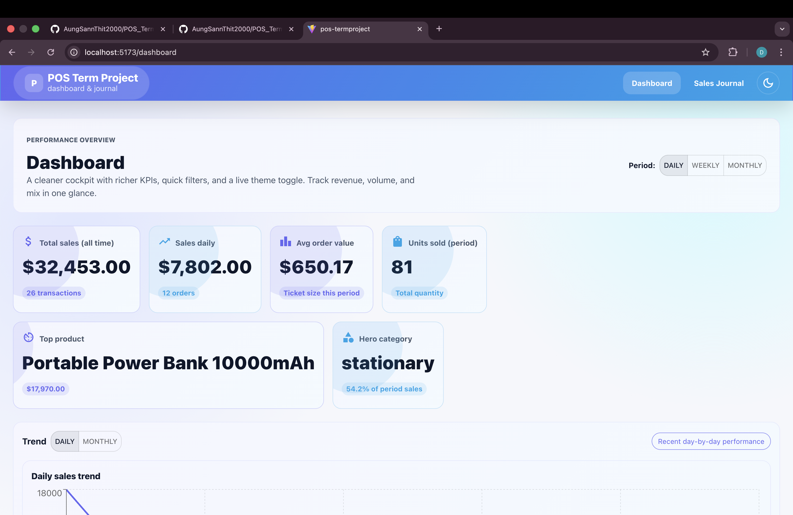
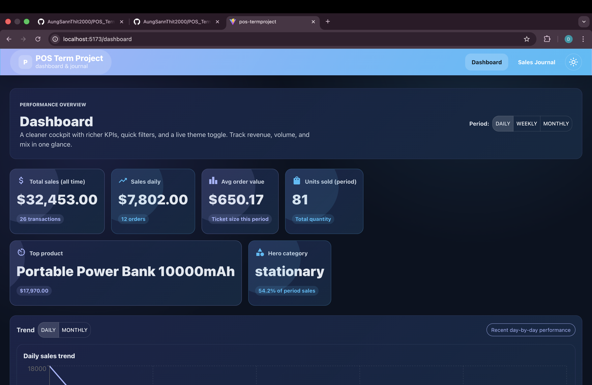
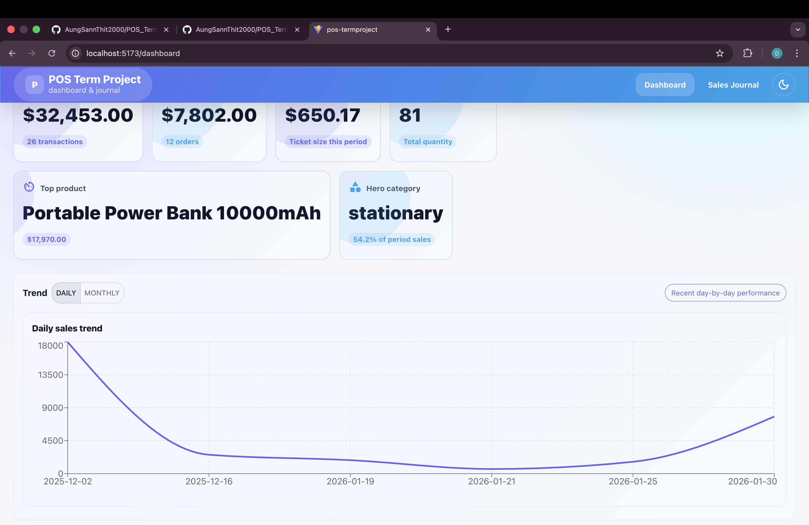
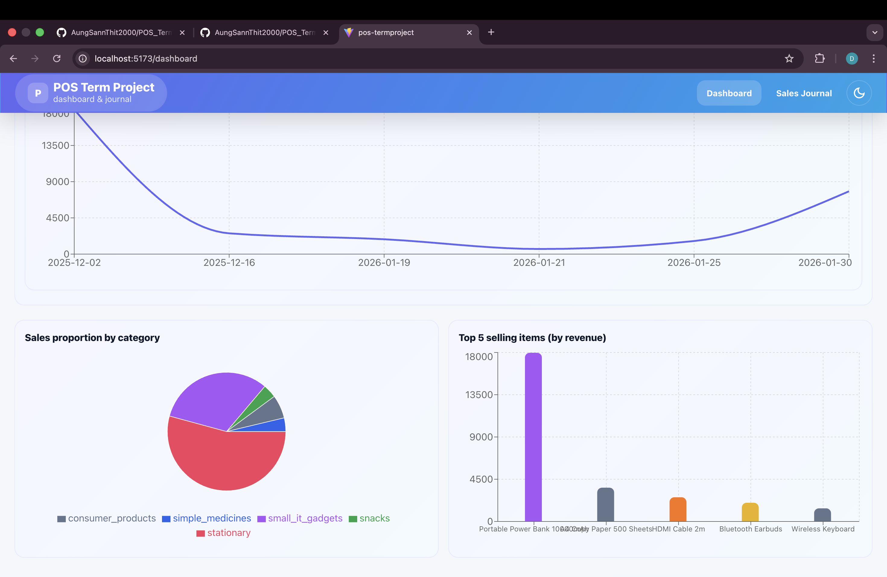
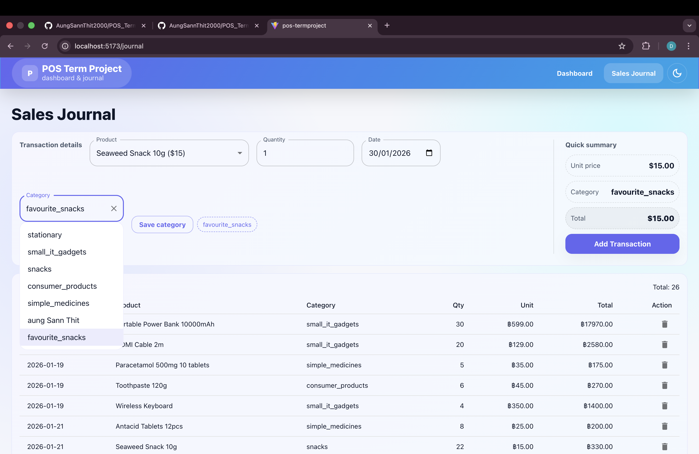

# Project 01: Basic POS (Point of Sale)
 
This project is a **Basic POS (Point of Sale) web application** developed using **React (Vite)**.  
It allows users to record sales transactions and view summarized sales data through a dashboard.
 
---
 
## Team Members
 
This project was developed by the following team members:
 
- **May Thu Chit (6715141)**  
  GitHub: [MThuChit](https://github.com/MThuChit)
 
- **Aung Sann Thit(6712111)**  
  GitHub: [AungSannThit2000](https://github.com/AungSannThit2000)
 
- **Aung Chan Myint (6715111)**  
  GitHub: [Gebu19](https://github.com/Gebu19)
 
---
 
## Technologies Used
 
- React (Vite)
- JavaScript (JSX)
- Material UI (MUI)
- Recharts
- React Router
- Browser Local Storage
- GitHub Pages (Deployment)
 
---
 
## Application Features
 
### Sales Journal
- Add sales transactions by selecting product, quantity, and date
- Automatic total price calculation
- Input validation (no negative quantity)
- Support for custom categories
- View and delete transaction records
- Data persistence using Local Storage
 
### Dashboard
- Total sales of all time
- Sales summary by period (Daily / Weekly / Monthly)
- Sales proportion by category (Pie Chart)
- Sales trends (Line Chart)
- Top 5 selling items by revenue (Bar Chart)
 
---
 
## Core Features

## 🌓 Adaptive User Interface
The system features a fully responsive design with a live theme toggle, allowing users to switch between Light and Dark modes for optimal visibility in any environment.

### 📊 Comprehensive Dashboard
| Light Mode | Dark Mode |
|:---:|:---:|
|  |  |
| *Clean high-contrast performance cockpit.* | *Reduced-glare interface for low-light settings.* |

### 📈 Sales Trend Analytics
| Light Mode | Dark Mode |
|:---:|:---:|
|  | .png) |
| *Daily revenue fluctuations and growth patterns.* | *Optimized data visualization in dark theme.* |

### 🍕 Category & Product Distribution
| Light Mode | Dark Mode |
|:---:|:---:|
|  | .png) |
| *Revenue split and top product rankings.* | *Dark mode analytics breakdown.* |

### 📝 Sales Journal & Entry
| Light Mode | Dark Mode |
|:---:|:---:|
|  | .png) |
| *Operational interface for transaction entry.* | *Dark mode transaction management.* |
 
---
 
## How to Run the Project
 
```bash
npm install
npm install recharts
npm install react-router-dom
npm run dev
