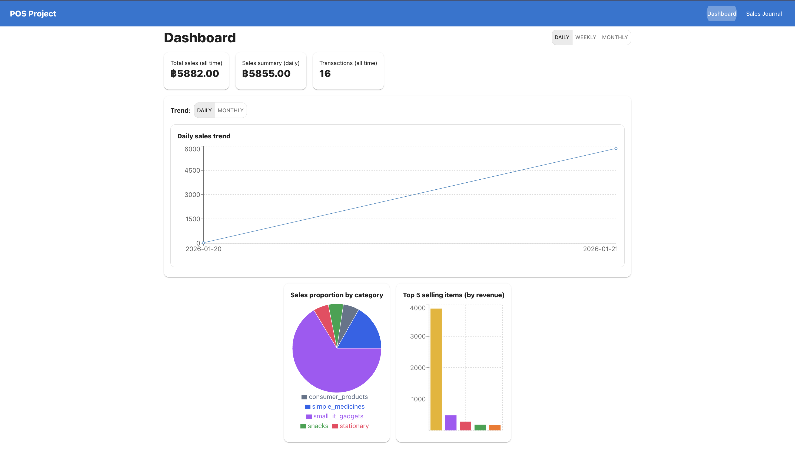
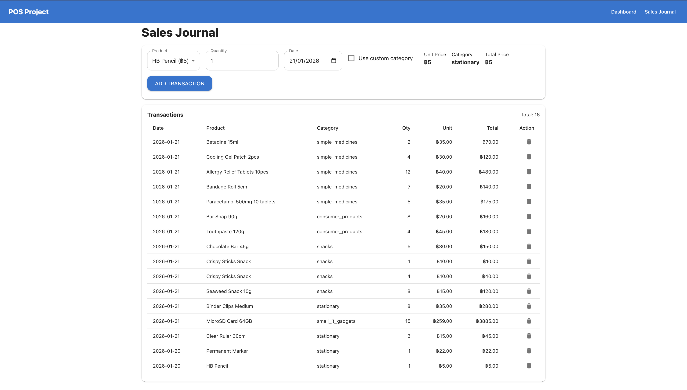

# Project 01: Basic POS (Point of Sale)
 
This project is a **Basic POS (Point of Sale) web application** developed using **React (Vite)**.  
It allows users to record sales transactions and view summarized sales data through a dashboard.
 
---
 
## Team Members
 
This project was developed by the following team members:
 
- **May Thu Chit**  
  GitHub: [MThuChit](https://github.com/MThuChit)
 
- **Aung Sann Thit**  
  GitHub: [AungSannThit2000](https://github.com/AungSannThit2000)
 
- **Aung Chan Myint**  
  GitHub: [Gebu19](https://github.com/Gebu19)
 
---
 
## Technologies Used
 
- React (Vite)
- JavaScript (JSX)
- Material UI (MUI)
- Recharts
- React Router
- Browser Local Storage
- GitHub Pages (Deployment)
 
---
 
## Application Features
 
### Sales Journal
- Add sales transactions by selecting product, quantity, and date
- Automatic total price calculation
- Input validation (no negative quantity)
- Support for custom categories
- View and delete transaction records
- Data persistence using Local Storage
 
### Dashboard
- Total sales of all time
- Sales summary by period (Daily / Weekly / Monthly)
- Sales proportion by category (Pie Chart)
- Sales trends (Line Chart)
- Top 5 selling items by revenue (Bar Chart)
 
---
 
## Screenshots
 
### Sales Journal Page

 
### Dashboard Page

 
---
 
## How to Run the Project
 
```bash
npm install
npm install recharts
npm install react-router-dom
npm run dev
